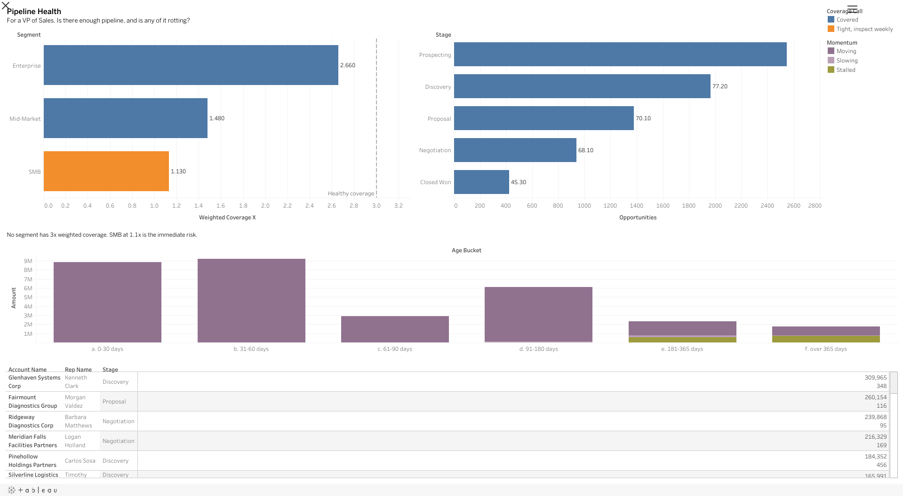
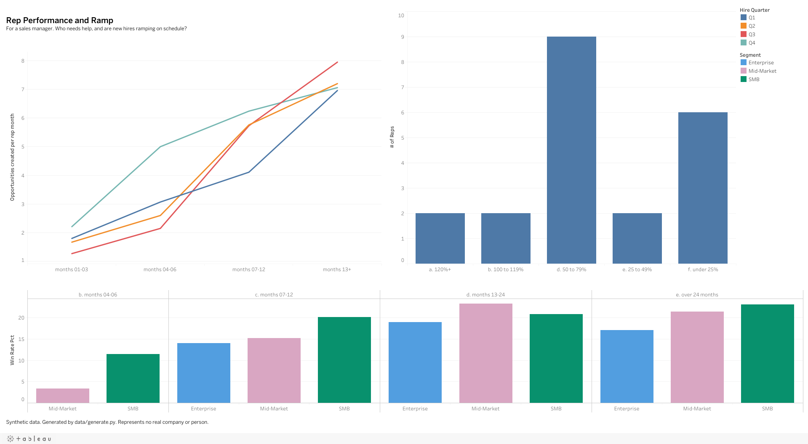
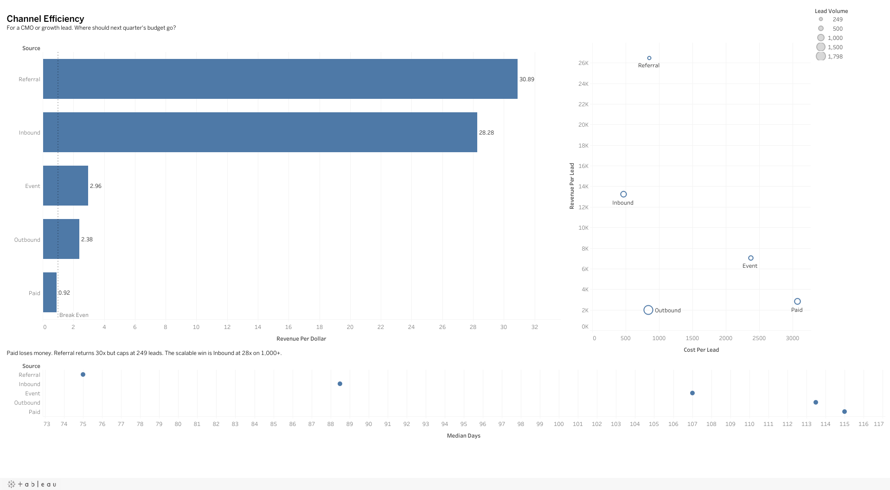
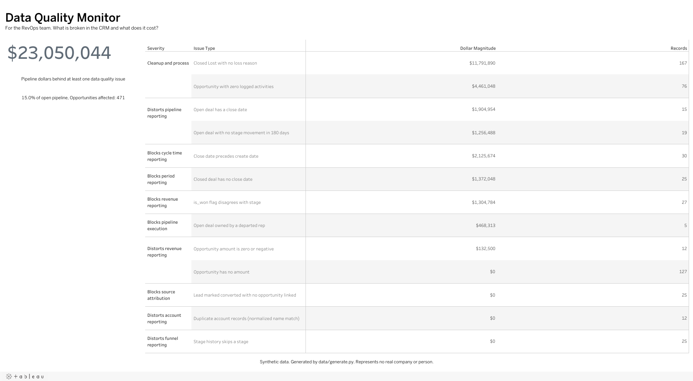

# revops-pipeline-analytics

Fourteen SQL analyses a revenue operations team actually runs,
against a synthetic B2B sales pipeline.

> **The data in this repository is synthetic and generated by
> [`data/generate.py`](data/generate.py). It represents no real
> company, customer, or employee.**

## Dashboards

Four Tableau Public dashboards built on these queries, one per
audience rather than one dashboard with everything on it.

<!-- PUBLISH: replace the two placeholders below with the real
     Tableau Public profile and workbook URLs, then delete this
     comment. -->
**Tableau Public profile:** `TABLEAU_PROFILE_URL_PENDING`

**Workbook:** `TABLEAU_PUBLIC_URL_PENDING`

<!-- PUBLISH: the four embeds below point at files that do not
     exist yet, so they render broken on purpose until they do.
     Capture them from the published dashboards rather than from
     Desktop, save them under bi/screenshots/ with exactly these
     names, then delete this comment. -->



*01 Pipeline Health. For the VP of Sales: is there enough
pipeline, and is any of it rotting?*



*02 Rep Performance and Ramp. For the sales manager: who needs
help, and are new hires ramping on schedule?*



*03 Channel Efficiency. For the CMO or growth lead: where should
next quarter's budget go?*



*04 Data Quality Monitor. For RevOps: what is broken in the CRM,
and what does it cost?*

Dashboard 04 is the one worth looking at first. Most BI portfolios
show revenue charts. This one quantifies what the dirty records in
a CRM cost and hands somebody the list to go fix, and clicking an
issue filters the work list to those records.

[`bi/README.md`](bi/README.md) has the reasoning: why Tableau
Public rather than Power BI, why four dashboards instead of one,
and eight charts that were considered and deliberately left off.
[`bi/DASHBOARD_SPECS.md`](bi/DASHBOARD_SPECS.md) is the sheet by
sheet build spec.

## Why this exists

I spent a few years running eight markets, and most of the
reporting questions that came at me came back to the same handful
of queries. Not exotic ones. Funnel conversion, ramp, source
efficiency, coverage, forecast accuracy, and a hygiene check
because the CRM was never clean. This is that set, written out
properly, against a dataset built to have the same problems a
real CRM export has.

The queries are the smaller half of it. Anybody can write a
`GROUP BY`. The part that took the actual work is the header on
each file: the question, the decision it drives, and the caveat
that says where the number stops being trustworthy. That last one
is the difference between a report and an argument you can defend
in a pipeline review.

## Run it

```
pip install -r requirements.txt
python setup.py            # generates the data, builds pipeline.duckdb, verifies it
python run_all.py          # runs all fourteen queries, exits nonzero if any fail
python bi/export_for_bi.py # writes the BI extracts and a traceability manifest
```

`./check.sh` runs the whole thing as a release gate: every query,
the hygiene reconciliation, the ramp assertion, em dashes, and any
publishing placeholders left in the repo. It has to exit zero
before this gets renamed or pinned.

No credentials, no cloud account, no server. DuckDB is a single
file on disk. A clean clone to query results is about thirty
seconds.

```
python run_all.py 03 12      # run specific queries, full output
python run_all.py --rows 50  # more rows per query
```

## The dataset

Twenty four months of B2B pipeline, 2024-01-01 through
2025-12-31, frozen at that end date. Queries use
`DATE '2025-12-31'` as their notion of today, so results do not
drift with the wall clock. The random seed is **4207**: same
seed, same database, every time.

| Table | Rows | Grain |
|---|---:|---|
| `territories` | 8 | One row per territory |
| `reps` | 25 | One row per seller, current and departed |
| `accounts` | 306 | One row per account record (300 companies, 6 duplicates) |
| `leads` | 4,000 | One row per lead |
| `opportunities` | 2,546 | One row per deal |
| `stage_history` | 6,563 | One row per stage change or ownership change |
| `activities` | 36,897 | One row per logged call, email, meeting, demo or note |

Stages run `Prospecting > Discovery > Proposal > Negotiation >
Closed Won | Closed Lost`. Full schema notes and design reasoning
are in [`schema/01_tables.sql`](schema/01_tables.sql).

### Deliberate imperfections

The dataset is dirty on purpose, because real RevOps work is
mostly dealing with the mess and a portfolio dataset that is
clean does not prove anything. Built in:

- **127 opportunities with no `amount`**, about five percent.
  Reps create records before they have a number.
- **30 deals that closed before they were created.** Backdated
  renewals and migration errors.
- **Six pairs of near duplicate accounts**, differing only by
  punctuation, case, or legal suffix.
- **25 deals in a closed stage with no close date**, and 15 open
  deals carrying one.
- **27 records where `is_won` disagrees with `stage`**, which
  means win rate depends on which column your report used.
- **19 open deals nobody has touched in six months**, several
  past 400 days, all of them still inflating coverage.
- **25 `stage_history` rows that skip a stage.** Reps jump
  Discovery, and the funnel undercounts it.
- **Five open deals still owned by reps who left**, plus 83 that
  were reassigned mid cycle, which is what makes rep level
  attribution genuinely hard.
- **167 Closed Lost records with no loss reason.** Not a
  reporting break, a learning break.

Ramp, attrition, seasonality, source quality differences and
forecast optimism are all modeled in as well, so the queries have
something real to find rather than noise. The full list, with
counts and reasoning, is in [`data/README.md`](data/README.md).

[`queries/12_data_hygiene_audit.sql`](queries/12_data_hygiene_audit.sql)
finds every item above and ranks it by what it breaks.

## The analyses

| # | Analysis | The question | Decision it informs |
|---|---|---|---|
| 01 | [Funnel conversion](queries/01_funnel_conversion.sql) | What share of deals reach each stage, and where is the biggest drop? | Whether to spend on qualification coaching or on late stage deal support |
| 02 | [Rep ramp by cohort](queries/02_rep_ramp_by_cohort.sql) | How long until a new seller is fully productive, and does the hire quarter matter? | When to hire, and what to carry a new rep at in the plan |
| 03 | [Lead source efficiency](queries/03_lead_source_efficiency.sql) | Which sources return revenue per marketing dollar, adjusted for cycle length? | Where next quarter's marketing budget goes |
| 04 | [Pipeline coverage](queries/04_pipeline_coverage.sql) | Does each segment have enough pipeline to hit next quarter? | Whether to keep selling or start building |
| 05 | [Forecast accuracy](queries/05_forecast_accuracy.sql) | When a deal is called Commit, how often does it close? | What multiplier to apply before the forecast goes to the board |
| 06 | [Win rate by segment](queries/06_win_rate_by_segment.sql) | Which segment and source pairs actually convert? | What the team should stop working |
| 07 | [Sales cycle length](queries/07_sales_cycle_length.sql) | How long does a deal really take, and how far is typical from average? | How far ahead pipeline has to be built |
| 08 | [Stage velocity bottleneck](queries/08_stage_velocity_bottleneck.sql) | Which stage is holding the pipeline up? | Which stage to attack, and with what intervention |
| 09 | [Activity to outcome](queries/09_activity_to_outcome.sql) | Do deals worked harder early win more often? | Whether an activity target is worth setting, and on what |
| 10 | [Cohort retention curve](queries/10_cohort_retention_curve.sql) | After a first purchase, how much more does an account buy? | New logo acquisition versus installed base growth |
| 11 | [Quota attainment distribution](queries/11_quota_attainment_distribution.sql) | Not the average. The distribution. | Whether the problem is the plan or the people |
| 12 | [Data hygiene audit](queries/12_data_hygiene_audit.sql) | What is broken in the CRM, and how much revenue sits behind it? | What to fix first, and which reports to stop publishing |
| 13 | [Pipeline aging](queries/13_pipeline_aging.sql) | How much of the open pipeline has stopped moving? | What to close out this week |
| 14 | [Territory capacity](queries/14_territory_capacity.sql) | Is each territory carrying more pipeline than its reps can work? | Where the next hire goes, and where to split a territory |

Every file opens with a QUESTION, a DECISION IT INFORMS, and a
CAVEAT block before any SQL. The caveat is not boilerplate. Each
one names the specific thing that would make the number wrong.

## Four tells that a number is wrong

The generator took four rounds to get right, and every wrong build
ran clean and returned a plausible looking table. Each round was
caught by a different tell, written up in full in
[`notes/BUILDING_THE_DATA.md`](notes/BUILDING_THE_DATA.md):

- **Arithmetic tell.** Every input defensible, the product absurd.
  Diagnostic: multiply your assumptions together before trusting
  any of them individually.
  ([Round 1](notes/BUILDING_THE_DATA.md), a 9.6 percent win rate.)
- **Sign tell.** A planted effect that measures backwards.
  Diagnostic: when something you know is there does not show up,
  suspect the measurement before the mechanism, and check the
  denominator first.
  ([Round 2](notes/BUILDING_THE_DATA.md), the ramp penalty.)
- **Magnitude tell.** A ratio three orders of magnitude off.
  Diagnostic: that is never a logic error, it is two quantities on
  different scales.
  ([Round 3](notes/BUILDING_THE_DATA.md), referral at 2,055x.)
- **Shape tell.** Monotonic and then a collapse in the top bucket.
  Diagnostic: that is a denominator artifact until proven
  otherwise, and the bucket boundaries usually say so if you print
  them.
  ([Round 4](notes/BUILDING_THE_DATA.md), the fake inverted-U.)

There is a fifth, added later, that is different in kind: it
detects a bad check rather than bad data. It is the closing
section of that document.

## The export layer

`python bi/export_for_bi.py` runs ten queries and writes one CSV
per extract into `bi/exports/`, with a
[`MANIFEST.md`](bi/exports/MANIFEST.md) recording row count,
column count, source query and SHA256 for each file. Two runs
against an unchanged database produce byte identical CSVs, and the
record level hygiene extract is reconciled against the summary
extract before anything is written, so the drill down and the
headline number cannot disagree.

Six extracts read `queries/` directly. Four live in `bi/queries/`
because a dashboard needed a grain the analysis query had already
collapsed away. Nothing in `queries/` was modified.

## Notes

[`notes/ANALYSIS.md`](notes/ANALYSIS.md) is what the data
actually says: four findings, what each one means, and what I
would do about it. Including one case where the pattern looked
like a finding, I checked the two explanations I expected, and
neither held, so it does not get reported as one.

[`notes/BUILDING_THE_DATA.md`](notes/BUILDING_THE_DATA.md) is the
log of the four rounds it took to get the generator right, each
written up as problem, diagnosis, fix, result. A 9.6 percent win
rate that turned out to be compounding stage gates. A ramp
penalty that was structurally unable to reach the band I was
measuring. A referral channel returning 2,055x because I had
priced consumer leads against enterprise deals. And a query that
produced a convincing inverted-U which was really a denominator
artifact. Every one of those builds ran clean and returned a
plausible looking table, which is the point of writing them down.

## Stack

DuckDB, Python, Faker, NumPy for the data and the analysis.
Tableau Public for the dashboards. No cloud services, no
credentials, no setup.
